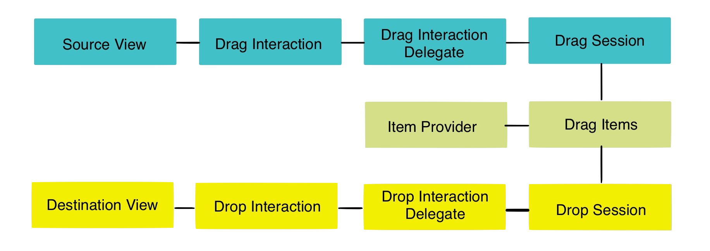

# [fit] __Drag__ ‘n’
# [fit] __Drop__

---

# [fit] __Drag__ ‘n’ __Drop__
# [fit] __—__
# [fit] Xcode __9 beta 6__
# [fit] github.com/sammyd
# [fit] /__iOSDevUK17_DragDrop__

---

---

# [fit] my
# [fit] name
# [fit] is
# [fit] __sam__

---

# [fit] github.com/__sammyd__
# [fit] @iwantmyrealname
# [fit] iwantmyreal.name
---

# [fit] razeware
# [fit] __raywenderlich.com__

---

# [fit] __buy__
# [fit] this
# [fit] book

---

# [fit] iOS __11__

---

# [fit] quite a
# [fit] __lot__ of
# [fit] __new__ stuff

---

# [fit] today...

---

# [fit] drag
# [fit] _**‘n’**_
# [fit] drop

---

---

# [fit] __collection__
# [fit] and __table__
# [fit] views have DnD
# [fit] __built in__

---

# [fit] BugRay

---

# [fit] credits go to
# [fit] __Mic Pringle__
# [fit] @micpringle

---

---

# [fit] Drag ‘n’ Drop
# [fit] __intra-app__
# [fit] __inter-app__

---

# [fit] There's
# [fit] __lot’s__
# [fit] more

---

# [fit] __buy__
# [fit] this
# [fit] book

---

# [fit] `github.com/sammyd`
# [fit] `/`__`iOSDevUK17_DragDrop`__
# [fit] —
# [fit] __@iwantmyrealname__
# [fit] iwantmyreal.name

